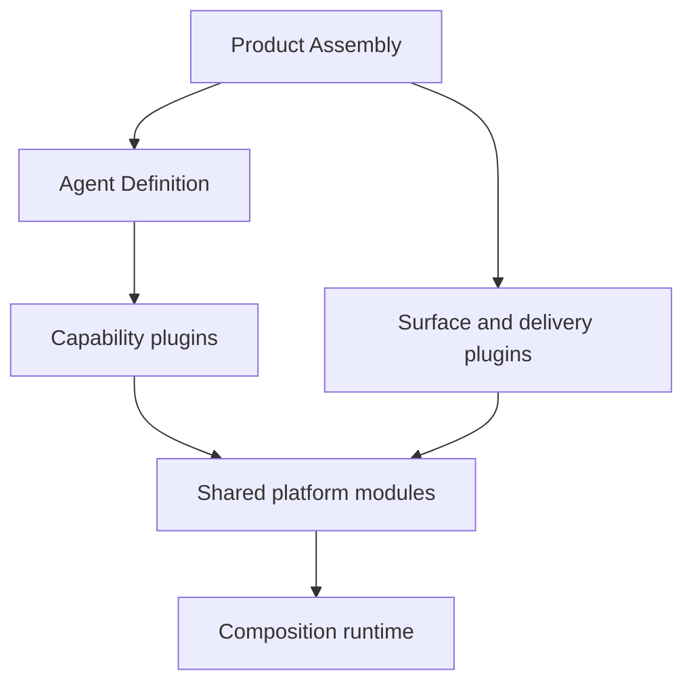
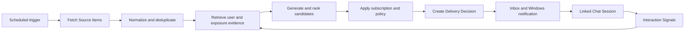

# Personal Agent Harness Architecture

## Purpose

Build a single-user, long-running Agent Harness that composes plugins into multiple Agent and product forms. The first forms are conversational Chat, scheduled personalized Push, and a headless Evaluation Runner. Extensibility is an implementation property; sustained personal usefulness and reproducible evidence are the product goals.

## Non-goals for the first release

- A multi-tenant SaaS or public account system.
- A plugin marketplace or a sandbox for malicious plugins.
- Autonomous creation or expansion of Push Subscriptions.
- A multi-Agent discussion system without a demonstrated independent role boundary.
- Distributed storage, multiple scheduler nodes, or PostgreSQL compatibility.
- Broad model-provider claims: DeepSeek is the only production model provider initially.

## Composition Model

- A **Plugin** provides one or more replaceable capabilities and declares dependencies, permissions, configuration, and lifecycle.
- An **Agent Definition** versions an Agent's goal, Model Policy, Agent Loop, tools, memory behavior, and permission ceiling.
- A **Product Assembly** combines entrances, Agent Definitions, delivery channels, and shared platform modules into a runnable product.

The Composition module may use Cordis directly. Agent-domain records and capability interfaces do not expose Cordis types. Cordis adoption remains conditional on the phase-zero lifecycle and composition spike.

## Top-level Modules

| Module | Interface responsibility | Hidden implementation complexity |
| --- | --- | --- |
| Composition | Inspect and atomically activate a versioned composition | Cordis contexts, dependency pending/resume, effect disposal, scopes, configuration reconciliation, rollback |
| Durability | Record Agent Events and manage persistent work | SQLite transactions, projections, idempotency, leases, retries, recovery, payload erasure |
| Agent Execution | Run a versioned Agent Definition | Model streaming, Agent Loop, tool permissions, checkpoints, budgets, context assembly, failure classification |
| Personal Context | Resolve and update user, Agent, source, and feedback state | Claims, provenance, conflicts, memory candidates, retention, evidence retrieval |
| Evaluation | Execute and compare reproducible evaluations | Run manifests, datasets, external Python adapters, artifact capture, graders, reports |

Only capabilities with multiple justified implementations receive an Adapter seam in the first release: Model, Agent Loop, Memory, Source Connector, Notification, and Benchmark. Scheduler, Event Journal, policy, and SQLite storage remain single deep modules and are tested through their normal interfaces.

## Product Assemblies

### Conversational Chat

Chat is a generic Surface, not a fixed Agent. A Session binds to an immutable Agent Definition version and may later be explicitly migrated or forked. A Run is durable and resumable; streaming UI output is derived from recorded execution state.

The first production Model Adapter is DeepSeek. It validates the actual DeepSeek Responses/API capability subset locally and normalizes reasoning, text, tool calls, usage, finish states, and failures. A deterministic fake supports contract, replay, and fault tests. Minimal ReAct and LangGraph.js provide the first Agent Loop comparison.

### Scheduled Personalized Push

Push occurs only inside a user-confirmed Push Subscription. Natural-language creation produces a Push Subscription Candidate that shows the parsed topic, sources, schedule, timezone, channel, item budget, filters, and validity period before activation.

Interaction Signals may rank content within an existing subscription. They cannot create, broaden, accelerate, or extend one. Explicit language can create an Explicit Claim; follow-up questions and behavior are weaker evidence that require repeated support before becoming an Inferred Claim.

The first real subscription is a daily 20:00 digest of selected RSS feeds and GitHub repositories, limited to five Agent/LLM engineering items with novelty, personal relevance, evidence, and suggested action. The first independently packaged plugin is `github-release-watch`.

### Evaluation Runner

Evaluation is a headless Product Assembly using the same plugins, Agent Definitions, events, and budgets as production. Official Python benchmark environments remain authoritative; versioned adapters invoke them and import normalized results without reimplementing their graders.

## State and Memory

State ownership is independent of plugin lifetime:

- User scope owns profile facts, preferences, goals, constraints, current focus, subscriptions, sources, and grants.
- Agent scope owns one Agent Definition's durable memory, tasks, and policy state.
- Session scope owns one bounded interaction history.

Memory distinguishes episodic, semantic, procedural, and working state. Models propose Memory Candidates; the Personal Context module validates schema, provenance, duplication, conflict, scope, and policy before accepting durable state. Retrieval returns an Evidence Bundle rather than a prebuilt prompt.

Claims preserve whether they are explicit or inferred, their provenance, effective time, confidence, scope, and sensitivity. New claims supersede or contradict prior claims rather than silently overwriting them.

## Durability and Events

- Runtime Events are transient Cordis/plugin coordination signals.
- Agent Events are append-only durable facts used for recovery, explanation, auditing, and evaluation.
- Sensitive payloads are separable from event envelopes so user-requested erasure can remove payloads and derived state while retaining a minimal deletion fact.
- Persistent jobs belong to the Durability module. Plugins register work; they do not own ordinary long-lived timers.

The first storage implementation is SQLite in WAL mode plus a content-addressed artifact directory. The runtime is single-node. Tests use real temporary SQLite databases.

## Execution and Safety

Every tool declares schemas, effect class, permission requirements, idempotency, timeout/cancellation behavior, result limits, sensitive fields, and optional compensation. Pure and authorized reads may execute automatically; external or destructive effects require confirmation unless a narrow standing grant exists.

Each Run has a scenario-specific ExecutionBudget. Interactive Chat may leave model turns unbounded while retaining cancellation, timeouts, cost visibility, and side-effect approval. Scheduled, Push, and Evaluation runs require finite wall-clock, token/cost, retry, and side-effect budgets. Budget exhaustion checkpoints a resumable `budget_exhausted` outcome.

In-process TypeScript plugins are trusted code. Permission manifests provide cooperative policy and audit evidence, not protection from malicious Node.js code.

## Deployment and Operations

- Node 24, pnpm 11, TypeScript, and a pnpm workspace.
- React and Vite for Chat and the control plane; Fastify for the daemon API; SSE for Run streams; installable PWA shell.
- Windows is the primary desktop target and Linux the supported private-server target.
- The daemon binds to localhost by default. Remote access uses a private network, tunnel, or user-managed HTTPS reverse proxy.
- Initial delivery is the in-app inbox plus Windows notifications. Missed schedules catch up with deduplication after wake.
- Secrets are references backed by the OS credential store or deployment Secret Provider; they never enter configuration, Agent Events, or benchmark artifacts.
- Backups combine an SQLite online snapshot, artifact manifest, configuration, plugin lock, and schema versions. Restore tests are part of operations.

Agent Events, OpenTelemetry traces, metrics, and debug logs remain distinct and are linked by identifiers. The control plane exposes Runs, Claims, Push Subscriptions, Sources, Permissions, Plugins, Costs, Evaluations, export, and erasure.

## Evaluation

The evidence hierarchy, targets, benchmark resources, dataset separation, evaluator calibration, cadence, and comparison rules are defined in [Benchmark Strategy](./benchmarks/strategy.md). The first release combines deterministic Harness Resilience tests, LongMemEval-V2, a pinned tau3-bench subset, project-owned ProactiveEval, and 30 days of longitudinal personal-use evidence.

